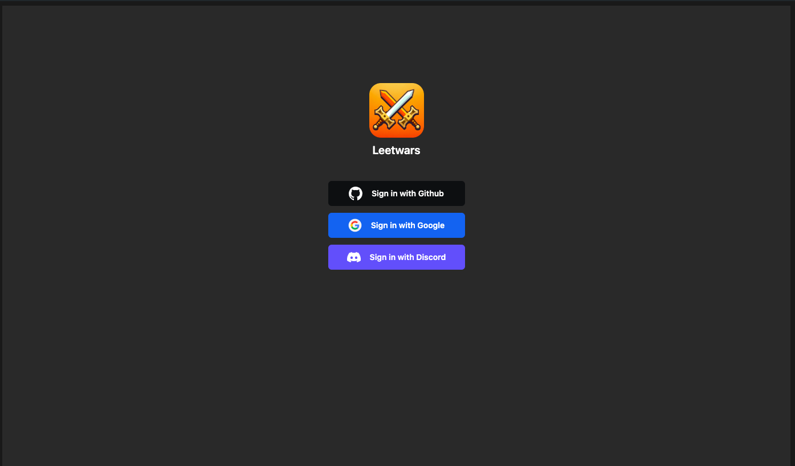
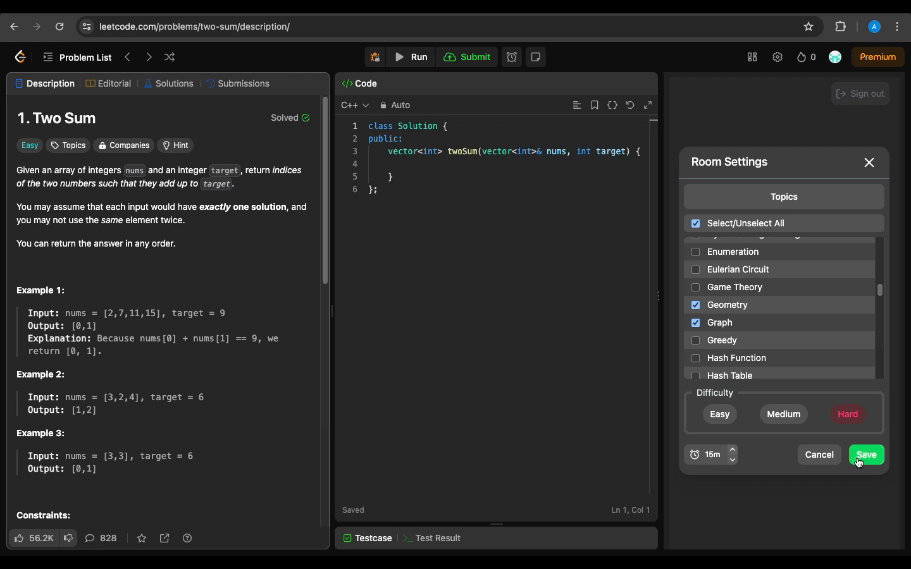
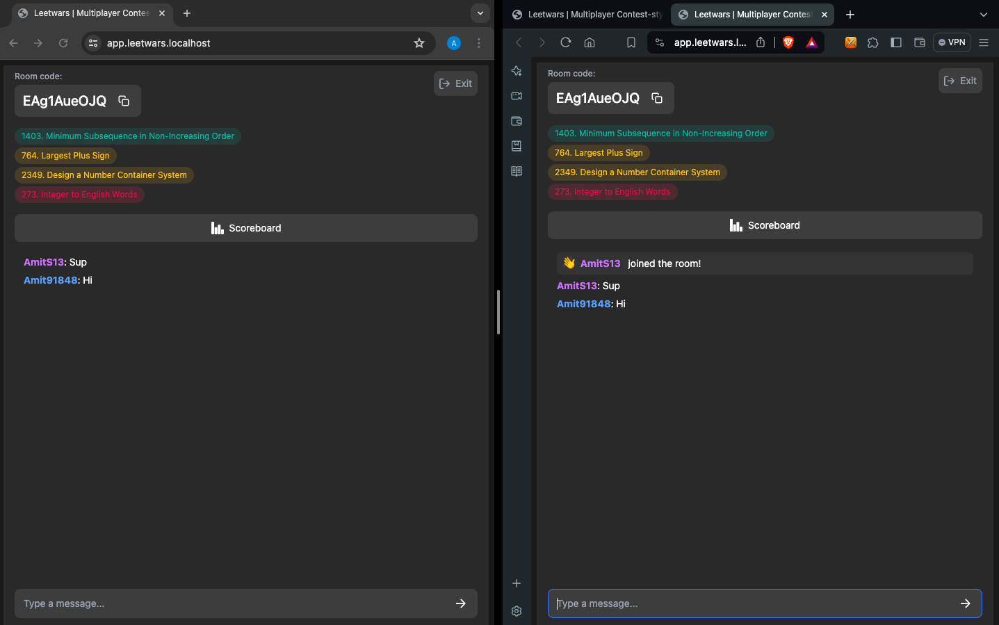
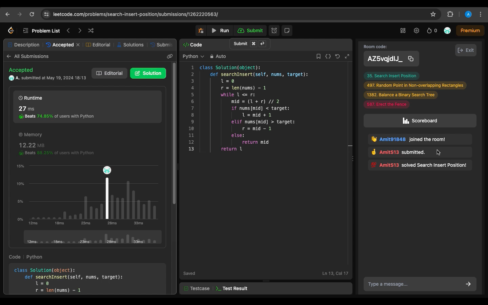
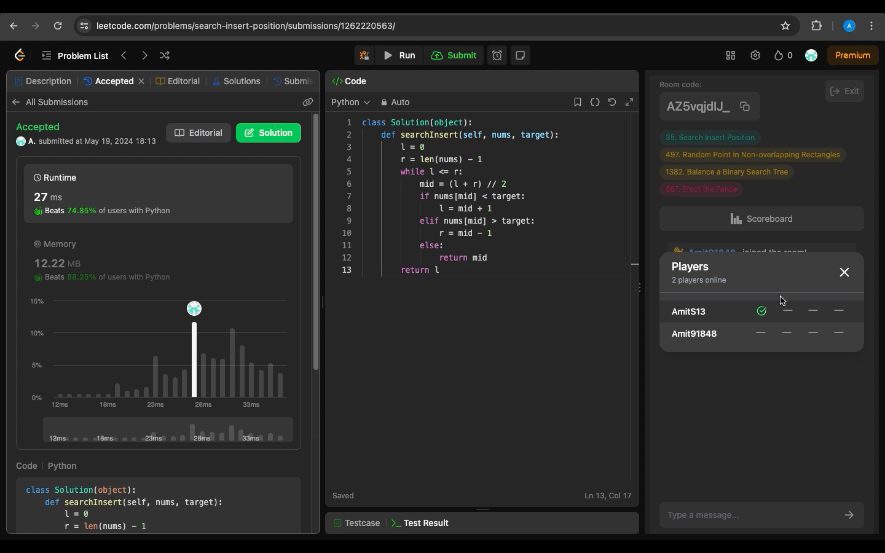

# Features

- Establish competitive multiplayer environments
- Engage in real-time conversations with other participants
- Tailor the room configurations to focus on particular subjects
- Authenticate using GitHub, Google, or Discord

## DEMO

### Authenticate using GitHub, Google, Discord, or Twitch

### Tailor rooms based on your preferences

### Engage in real-time conversations with other participants

### Submit your solution and see how you rank

